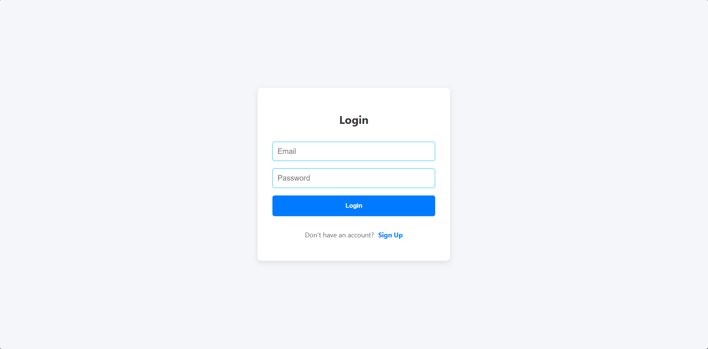
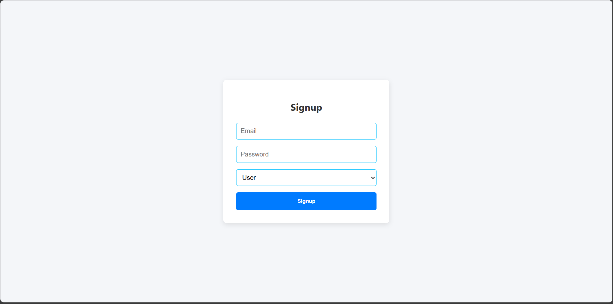
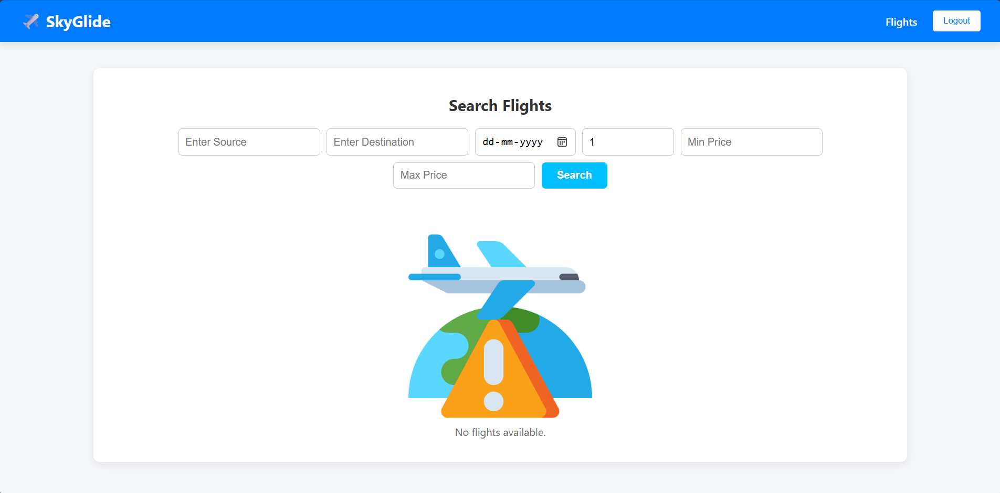
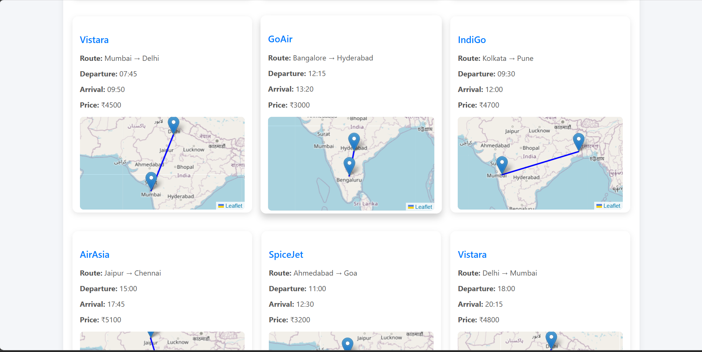
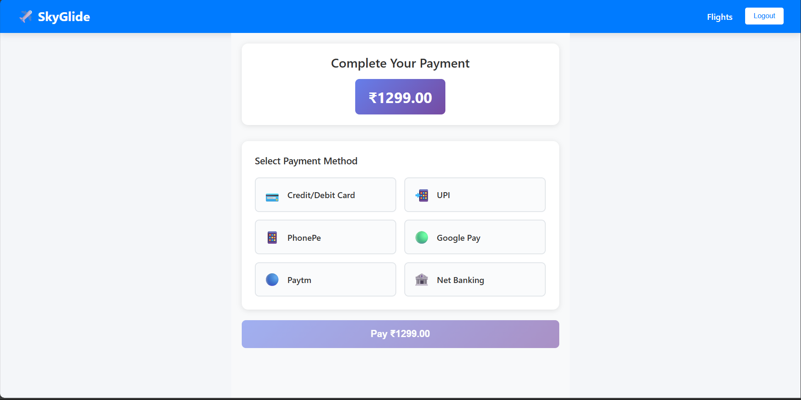

# ✈️ Flight Booking React App

This is a flight booking application built with React and React Router. It includes user authentication, flight search, booking, payment, and an admin dashboard.

> 🔗 Live Project: *(Add your live Netlify/Vercel link here after deployment)*  
> 📁 GitHub Repository: [Shreyasssonar/flightbookingapp](https://github.com/Shreyasssonar/flightbookingapp)

---

## 📄 Pages & Features

### 1. Login Page

The entry point for users to log in.



---

### 2. Signup Page

Allows new users to register.



---

### 3. Search Flights Page

Users can search available flights by entering source, destination, and dates.

  


---

### 4. Booking Page

Users can select and confirm their flight bookings here.


---

### 5. Payment Page

Handles payment for flight bookings with multiple payment options.



---

### 6. Admin Dashboard

Dashboard for admin users to manage flights, bookings, and users.


---

## 🛠️ How to Run Locally

1. Install dependencies:

```bash
npm install
